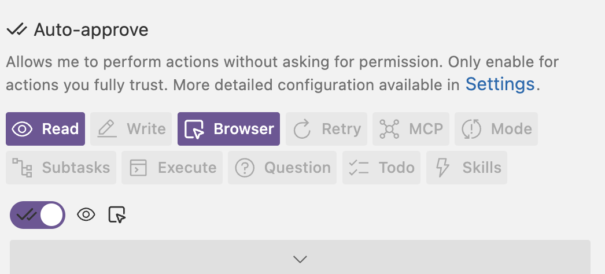

# 詳細セットアップガイド

## 推奨環境

| OS        | Node.js   | npm   |
| --------- | --------- | ----- |
| macOS 14+ | v20.x LTS | v10.x |

---

## 1. Node.js のインストール

### macOS（Homebrew を使う場合）

```bash
# brewが入ってるか確認
brew -v
# Homebrew がない場合は先にインストール
/bin/bash -c "$(curl -fsSL https://raw.githubusercontent.com/Homebrew/install/HEAD/install.sh)"

# Node.js インストール
brew install node

# バージョン確認
node --version   # v20.x.x 以上であること
npm --version    # v10.x.x 以上であること
```

### macOS

1. ターミナル

```bash
node --version
npm --version
```

---

## 2. Git のインストール

### macOS

```bash
git --version
# なければ
brew install git
```

---

## 4. リポジトリのクローンとアプリ起動

```bash
# リポジトリをクローン
git clone <リポジトリURL>
# gitがない場合はアプリをzipでダウンロードして展開してください。
cd e2etest_web


# 依存パッケージをインストール（初回のみ）
npm install

# 開発サーバーを起動
npm run dev
```

`http://localhost:3000` を開いてログイン画面が表示されれば成功です。

<!-- ---

## 5. Playwright MCP の確認

このアプリは `.bob/mcp.json` に Playwright MCP の設定が含まれています。Bob 起動時に自動的に読み込まれます。

### 設定内容（`.bob/mcp.json`）

```json
{
  "mcpServers": {
    "playwright": {
      "command": "npx",
      "args": [
        "-y",
        "@playwright/mcp@latest",
        "--browser=chromium",
        "--viewport-size=1280,800"
      ]
    }
  }
}
```

- `--browser=chromium`: Chromium を使用します
- `@playwright/mcp` は `npx` で自動ダウンロードされるため、個別インストールは不要です

--- -->

## 6. テスト実行の確認

アプリが起動した状態で Bob を開き、以下のプロンプトを実行します:

```
@/tests/scenarios/TC-001-login-success.md を読んで、テストを実行してください
```

Bob がブラウザ開き、自動操作を開始します。

テストが完了したら、`Ctrl + C`でアプリを止めることができます。

---

## トラブルシューティング

### BobのTool操作ミス (以下のようなメッセージが表示される場合)

BobはミスをFBし、次のアクションで修正しながらテストを進めていきます。

```bash
Bob tried to use browser_action for 'Invalid coordinate format: "449,333". Expected format: "x,y@widthxheight" (e.g., "450,300@1024x768")' without value for required parameter 'coordinate'. Retrying...
```

基本的にはテスト自体は問題なく実行可能ですが、より揺らぎの少ない操作をさせたい場合は

- Toolの使い方を明記する。
- SkillやAGEMTS.mdにテストのワークフローや振る舞いを詳細に明記する

といった方法があります。

### BobのAuto-approve(自動認証)を設定したい。

有効化した機能については人間のapprove無しで操作を続行することができる。



例えば上記の設定であれば、`Read`や`Browser`(ブラウザ操作)は自動で操作してくれるが、それ以外のターミナルでの`Execute`や`Todo`の実行は人間の許可が必要となる。

### `npm install` でエラーが出る

Node.js のバージョンを確認してください。v18 未満の場合はアップデートが必要です。

```bash
node --version
```

### ポート 3000 がすでに使用されている

別のプロセスがポートを使用しています。使用中のプロセスを終了するか、別のポートで起動します:

```bash
npm run dev -- -p 3001
# この場合、テストシナリオの URL も localhost:3001 に変更してください
```
